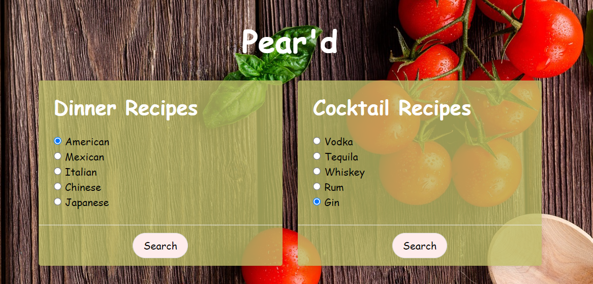

# Pear'd

## Description

Take the guess-work out of the dinner equation and head over to Pear'd to select from a intercontinental, multi-cultural dinner recipe list and have it perfectly paired with a cocktail recipe that complements the paletes of each selected dish.

Pear'd provides images, ingredients list, and recipes with 2 clicks of a button. Feel like a five star chef and bartender all in the comfort and privacy of your own home.

## User Story

 Tired of the same chicken recipe? Is that steak over-cooked? What cocktail should I have with my meal? Cooking dinner will never be easy. As a parent coming up with creative ideas for dinner shouldn't be diffuclt. With Pear'd we can solve these issues with a couple clicks.

 ## Process

 ### Technology

 * HTML
 * CSS
 * jQuery
 * APIs  (Cocktail DB & Edamam)
 * Javascript

 ### Task and roles:

 * Front-End: Austin, Khamla
 * Back-End: Lauren, Samson, Neel
 * README: Khamla 
 * Presentation: Whole Team

 ## Future Advancement

 * Add map options to locate a restaurant that matches your food choice.
 * Partner with Instakart, Grubhub, or Peapod to have ingredients and groceries delivered.
 * Video tutorials for both food and drink options.
 * Have local storage so that you search history saves on the page.
 * Create a search function that can increase search for a specific dish.
 * Option to comment and rate recipies.

## Wesbite Preview

### <ins>[Pear'd](https://sampaul10.github.io/Pear-d/)</ins>

 

## Contributions
Lauren Szalkiewicz : [Github Page](https://github.com/laurszalk) 
Austin Stancil : [Github Page](https://github.com/AustinS86) 
Neel Chakravartty: [Github Page](https://github.com/NeelCheo) 
Samson Paul: [Github Page](https://github.com/sampaul10) 
Khamla Soumpholphakdy: [Github Page](https://github.com/soumpholphakdy)
